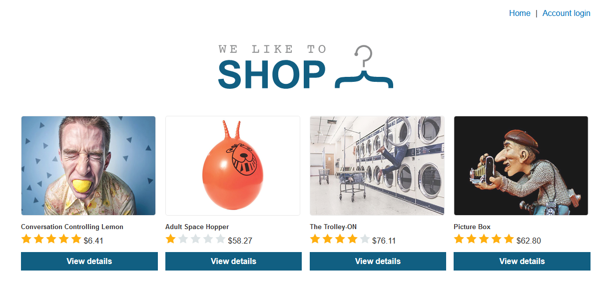
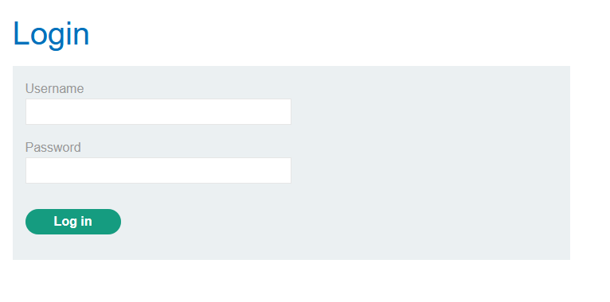
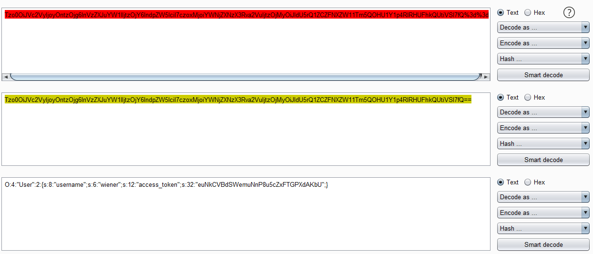
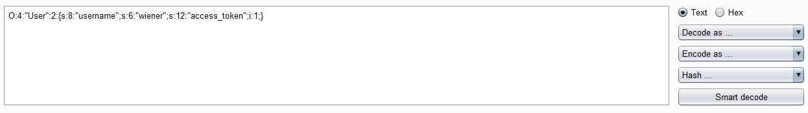
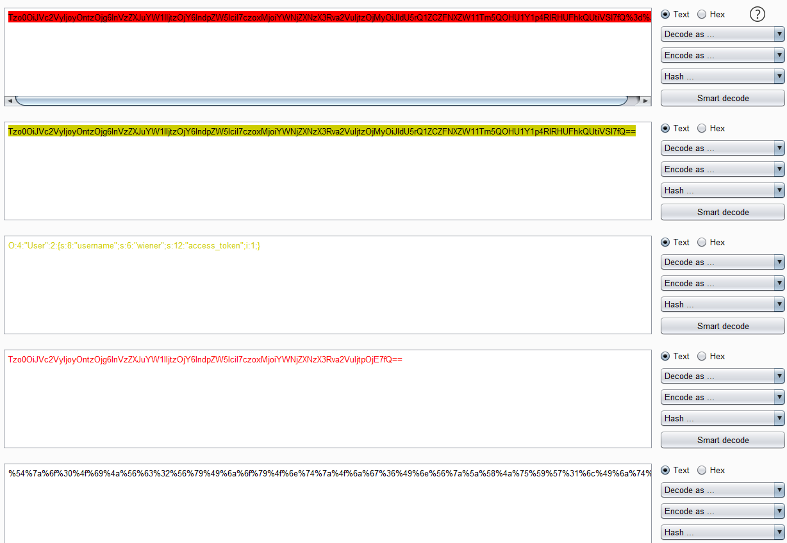
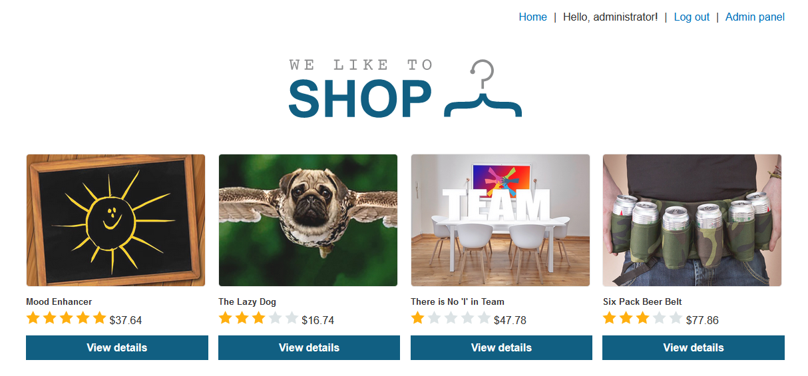
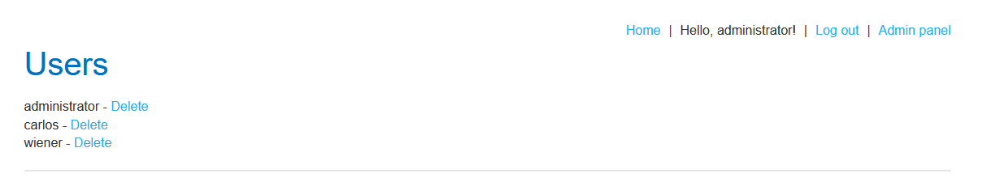

# Modifying serialized data types

## Level
``PRACTITIONER``

## Goal
This lab uses a serialization-based session mechanism and is vulnerable to authentication bypass as a result. To solve the lab, edit the serialized object in the session cookie to access the ``administrator`` account. Then, delete Carlos.

You can log in to your own account using the following credentials: ``wiener:peter``

## Prerequisites

1. You should have read the sections until this lab.
2. Burp Suite Community/Professional

## Video

[](https://www.youtube.com/watch?v=l7KCL7vY98k)

## Start

You should configure your browser and proxy to intercept messages.

Your application looks similar to the following screenshot. Keep in mind that your products can have a different arrangement and of course, it can be different products. The lab environment will be generated automatically and that is the reason why things can be different. Click at the **Account login** link in the upper right of the window.



Click at the **Account login** link in the upper right. The login form should appear.



Enter the username ``wiener`` and the password ``peter``. Click at the **Log in** button. You are now logged in. You can proof this in the upper right, there should be a text like **Hello, wiener**. Switch to your proxy and open the “**HTTP history**” tab. Search for a request that looks like the following one. Keep in mind that your lab id is different to this lab id.

```http
GET / HTTP/1.1
Host: acb41f2e1f6d6ff98009aa7a00d6007d.web-security-academy.net
User-Agent: Mozilla/5.0 (Windows NT 10.0; Win64; x64; rv:79.0) Gecko/20100101 Firefox/79.0
Accept: text/html,application/xhtml+xml,application/xml;q=0.9,image/webp,*/*;q=0.8
Accept-Language: de,en-US;q=0.7,en;q=0.3
Accept-Encoding: gzip, deflate
Referer: https://acb41f2e1f6d6ff98009aa7a00d6007d.web-security-academy.net/login
Connection: close
Cookie: session=Tzo0OiJVc2VyIjoyOntzOjg6InVzZXJuYW1lIjtzOjY6IndpZW5lciI7czoxMjoiYWNjZXNzX3Rva2VuIjtzOjMyOiJldU5rQ1ZCZFNXZW11Tm5QOHU1Y1p4RlRHUFhkQUtiVSI7fQ%3d%3d
Upgrade-Insecure-Requests: 1
```

Mark the value of the ``Cookie`` header and open the context menu. Here, click **Send to Decoder**. Open the Burp Decoder and click the button **Decode as …** and choose **URL**. A new section appears, here click the **Decode as …** button again and choose **Base64**. Your Decoder should look like the following screenshot.



You see the the ``username`` and the ``access_token``. As we have learned, changing variable types in PHP can be a great way to circumvent authentication in web applications. Change the value of the username to ``administrator`` and ``s:6`` to ``s:13`` which is the length of the username. Replace the string ``euNkCVBdSWemuNnP8u5cZxFTGPXdAKbU`` with ``0`` and change ``s:32`` to ``i``, which changes the variable type from string to integer. The complete string looks like ``O:4:"User":2:{s:8:"username";s:6:"wiener";s:12:"access_token";i:1;}``. 



Click the button **Encode as …** and choose **Base64** in the section that appears, click the **Encode as …** button again and choose **URL**.



Copy the URL encoded string to your clipboard and open your browser. Make sure that you intercept the traffic and hit the browser refresh button. In your proxy should appear a request that looks like the following.

```http
GET / HTTP/1.1
Host: ac361fec1ed41d2781a87345002a002b.web-security-academy.net
User-Agent: Mozilla/5.0 (Windows NT 10.0; Win64; x64; rv:79.0) Gecko/20100101 Firefox/79.0
Accept: text/html,application/xhtml+xml,application/xml;q=0.9,image/webp,*/*;q=0.8
Accept-Language: de,en-US;q=0.7,en;q=0.3
Accept-Encoding: gzip, deflate
Referer: https://ac361fec1ed41d2781a87345002a002b.web-security-academy.net/login
Connection: close
Cookie: session=Tzo0OiJVc2VyIjoyOntzOjg6InVzZXJuYW1lIjtzOjY6IndpZW5lciI7czoxMjoiYWNjZXNzX3Rva2VuIjtzOjMyOiJ2Q0p2UU5kQkQ4VkhhVk9VVE9nTEdRSVBhMmZmZGFrQiI7fQ%3d%3d
Upgrade-Insecure-Requests: 1
Cache-Control: max-age=0
```



You see in the upper right that you are now logged in as administrator. Click at the **Admin panel** link. In the appearing request in your proxy, you must replace the session value in the ``Cookie`` header again. Now, you can delete carlos. Keep in mind to replace the session value in the ``Cookie`` header.


